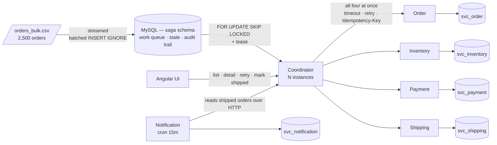
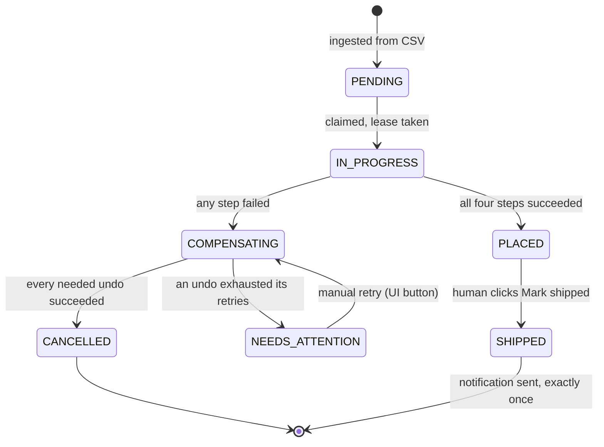

# Order Processing System — Saga Coordinator

[](https://github.com/eshaan5/order-saga/actions/workflows/ci.yml)

A distributed order processing system. Four services each own their own data; a coordinator drives
every order through all four **in parallel**, and rolls back the ones that succeeded if any step
fails.

| Step | Service | Do | Undo |
|---|---|---|---|
| Order | order | `CREATE_ORDER` | `CANCEL_ORDER` |
| Stock | inventory | `RESERVE_INVENTORY` | `RELEASE_INVENTORY` |
| Payment | payment | `CHARGE_PAYMENT` | `REFUND_PAYMENT` |
| Shipping | shipping | `CREATE_SHIPMENT` | `CANCEL_SHIPMENT` |

Plus a **Notification service**, deliberately outside the saga, which sends exactly one notification
per shipped order.

---

## Prerequisites

- **Node ≥ 22.22.3** (`nvm use` — there's an `.nvmrc`). The floor comes from the Angular CLI; the
  backend itself runs on older 22.x.
- **Docker** — for MySQL 8.4 and Redis.

---

## Quick start

```bash
# 1. infrastructure
npm install
npm run db:up                 # MySQL 8.4 + Redis. Wait ~30s on first run.

# 2. build + seed
npm run build                 # tsc -b across all packages
npm run seed                  # 10 SKUs x 50,000 units from data/sample_inventory.csv
```

Then **three terminals**:

```bash
# terminal 1 — the four worker services (ports 3001-3004)
npm run dev:services

# terminal 2 — the coordinator: claim loop + read API (port 3000)
npm run dev:coordinator

# terminal 3 — the notification service (port 3005)
npm run dev:notification
```

And the UI:

```bash
# terminal 4
cd web && npm install && npm start      # http://localhost:4200
```

### Load the orders

```bash
npm run ingest                # streams data/orders_bulk.csv — 2,500 orders
```

The coordinator starts claiming batches immediately. Watch it live:

```bash
while true; do clear; curl -s localhost:3000/api/stats | jq; sleep 1; done
```

Or just open http://localhost:4200 and turn on **Auto-refresh**.

### Expected result

The run is deterministic. When it settles:

| Status | Count | Why |
|---|---:|---|
| `PLACED` | **2319** | no failure flags in the CSV |
| `CANCELLED` | **164** | `fail_at` set — a step fails, everything undone cleanly |
| `NEEDS_ATTENTION` | **17** | `fail_at` **and** `comp_fail_at` — an undo also fails |
| | **2500** | |

Those three numbers are the acceptance test. They match a direct analysis of `orders_bulk.csv`, so
hitting them exactly means the parallel fan-out, retries, fault injection, compensation selection and
needs-attention path are all correct together.

---

## What to look at

**Re-loading the same file does not duplicate.** Run `npm run ingest` again →
`rowsInserted: 0, rowsSkipped: 2500`. Enforced by `UNIQUE(order_id)` + `INSERT IGNORE`, so it holds
even if two people run it simultaneously.

**A cancelled order.** Open any `CANCELLED` order in the UI. The detail page shows all four forward
steps with their retry counts, then the undo steps — including any marked `SKIPPED`, meaning that
forward step never succeeded so there was nothing to undo.

**A needs-attention order — try `ORD001337`.** `CREATE_ORDER` fails after 3 tries; the other three
succeed; the undos run; `RELEASE_INVENTORY` fails every attempt. The order is flagged rather than
dropped silently, and the **Retry undo** button clears it.

**Restart mid-run.** `Ctrl+C` the coordinator while orders are processing, then start it again.
In-flight orders keep their leases, go stale after 60s, and are reclaimed — nothing lost, nothing
repeated.

**Exactly one notification.**

```bash
# mark a few placed orders shipped, then:
curl -s -X POST localhost:3005/api/notifications/run | jq   # claimed: N, sent: N
curl -s -X POST localhost:3005/api/notifications/run | jq   # claimed: 0, sent: 0
```

---

## Running multiple instances

Every service is safe to run as several copies at once. Start extras on different ports:

```bash
# a second coordinator — it will share the order backlog with the first
COORDINATOR_PORT=3010 npm run dev:coordinator

# a second notification service
NOTIFICATION_PORT=3006 npm run dev:notification
```

Watch both coordinators' logs during an ingest: they claim **different** batches and never the same
order. Nothing coordinates them — no leader election, no lock service, no partitioning. Two mechanisms
do all of it:

- `SELECT … FOR UPDATE SKIP LOCKED` — a row already locked by one instance is passed over by the
  other, so a claim query run simultaneously by N instances returns N disjoint sets.
- `UNIQUE(idempotency_key)` in each service — even if two coordinators somehow drove the same order,
  the second call replays a stored response instead of re-executing.

Same story for notifications: `INSERT IGNORE` + `UNIQUE(order_id)` means exactly one instance wins
each order, whichever fires first.

Scale down to one of each and nothing changes — the design doesn't *require* multiple copies, it
survives them.

---

## Tests

```bash
npm run test:unit          # pure functions — nothing needs to be running
npm run test:integration   # needs MySQL + the four services up
npm test                   # both
```

| Suite | Covers |
|---|---|
| `test/unit/retry.test.ts` | backoff doubling + cap, jitter spread, non-retryable stops after one attempt |
| `test/unit/errors.test.ts` | retry classification, including unwrapping `fetch`'s hidden `.cause` |
| `test/integration/saga.test.ts` | all steps succeed · a step fails and everything is undone · nothing done twice |
| `test/integration/idempotency.test.ts` | 10 simultaneous identical charges → 1 payment · failed attempt doesn't poison its own retries · release gate |
| `test/integration/notification.test.ts` | 10 concurrent claims → 1 winner · 20 cron cycles → still 1 row · stale claim reclaimed |

---

## How it works



Four separate databases is the whole reason this is a saga. With one shared database an order
would be a single `BEGIN … COMMIT` and none of this design would exist.

### Order lifecycle



Two things worth reading off that diagram:

- **`NEEDS_ATTENTION` loops back into `COMPENSATING`.** That loop is requirement 7 — an undo that
  keeps failing is flagged for a human rather than dropped, and the Retry button re-enters the
  compensation phase.
- **`SHIPPED` is reachable only from `PLACED`, and only via a person.** Nothing in the saga produces
  it. That is how the notification service stays outside the order flow entirely.

### The two mechanisms that carry the design

**Deterministic idempotency keys.** Every call sends `Idempotency-Key: {orderId}:{STEP}` — derived,
never random, so every retry sends the *same* key. Each service has `UNIQUE(idempotency_key)` and
returns the **stored original response** on a duplicate.

This exists for one specific case: the coordinator times out at 3s, the charge actually succeeds at
3.1s, and the reply is lost. Without stored responses the retry can only report an error, the
coordinator compensates, and **an order that genuinely succeeded gets cancelled and refunded**. The
unique constraint protects the money; the stored response protects the decision.

**Claim + lease.** Row locks die at `COMMIT`, which is far too short for a saga spanning several HTTP
calls. So ownership is stored as data — `lease_owner` and `lease_expires_at`. A crashed coordinator
stops renewing; the lease goes stale; the next poll picks the order back up:

```sql
WHERE status = 'PENDING'
   OR (status IN ('IN_PROGRESS','COMPENSATING') AND lease_expires_at < NOW(3))
```

Restart recovery is that `OR` clause. There is no separate recovery daemon.

---

## Design decisions

**MySQL as the work queue, not SQS/Kafka.** Saga state has to be durable in MySQL anyway for restart
recovery, so a broker would add a second system to keep in sync and buy nothing.
`SELECT … FOR UPDATE SKIP LOCKED` gives multi-instance safety and crash recovery in one query, and
keeps `docker compose up` as the entire infrastructure setup. At much higher throughput a broker
would win — polling a table has a ceiling — but not at this scale.

**Synchronous HTTP, orchestration not choreography.** The coordinator needs each step's outcome to
decide what to compensate, and the per-step time limit is an HTTP timeout for free. With a queue
you'd build a separate timeout reaper to get the same behaviour.

**`Promise.allSettled`, never `Promise.all`.** `all` rejects on the first failure and abandons the
other three calls mid-flight, so you'd never learn whether they succeeded — and never compensate them
if they did. A silent money leak that only appears under failure.

**Compensation is driven by recorded state, not ordering.** Because the four steps run in parallel,
when one fails you cannot infer which others completed. The engine reads
`saga_steps WHERE kind='FORWARD' AND status='SUCCEEDED'` and undoes exactly those. `SKIPPED` rows in
the UI are that decision made visible.

**Injected `fail_at` failures return HTTP 500, not 4xx.** 4xx is classified non-retryable, so the step
would die on attempt 1 and never demonstrate the retry behaviour. A 500 exercises all three attempts
before compensating.

**Manual retry sends `force: true`.** Otherwise `comp_fail_at` fails unconditionally and the UI's
Retry button could never clear a `NEEDS_ATTENTION` order.

**Ingest batch size is a constant, not the file.** The batch size *is* the memory ceiling — "batch
everything" re-introduces the exact problem streaming solves, and also hits `max_allowed_packet` and
the 65,535-placeholder limit on large files.

**Shared code is infrastructure only.** `@saga/shared` has retry, idempotency, pooling and logging —
and zero business logic. `runIdempotent` doesn't know what a payment is. Putting domain code there
would make a pricing change force four redeploys, which is the distributed monolith failure mode.

**Inventory has two domain tables.** It's the only service with state shared across orders, so it
needs a per-SKU counter *and* a per-order reservation row. The reservation row is the gate that makes
`RELEASE_INVENTORY` idempotent — the naive `available_qty += qty` invents stock when run twice, and
nothing would ever detect it.

**Redis caches the "has this step already run?" lookup — and needs no invalidation.** A cache hit
returns the stored response without touching MySQL at all: no connection borrowed, no query.

The interesting part is why it's *safe*, since a stale cache here would mean a double charge. Two
properties do it:

1. Redis is written **only after the MySQL transaction commits**, so it can never assert an operation
   that the database might still roll back.
2. We only ever cache records in the `COMPLETED` state, and **a completed record is immutable** —
   nothing in the system updates or deletes one. (The only rows ever mutated or removed are
   `IN_PROGRESS` ones, which are never cached.)

So the cached value cannot go stale, because there is no newer value to go stale against. That's a
stronger guarantee than any invalidation strategy, and it's why this cache is safe rather than merely
fast. Every Redis operation also degrades to a no-op on failure — Redis down costs one extra DB round
trip and nothing else, which is why `/health` reports cache status but doesn't fail on it.

**The order list is deliberately NOT cached.** It changes on every single status transition during a
bulk run, so any TTL long enough to help would show a reviewer stale order statuses — actively
misleading, and the exact "cached information stays correct" failure the brief warns about. It's
served by a composite index instead.

---

## Known limits

- **One MySQL server, six schemas.** No service reads another's tables, but the isolation is a
  convention plus a shared credential rather than separate credentials per service. Real deployment
  would scope grants per service; splitting to separate servers is a connection-string change.
- **Offset pagination** in the order list degrades on deep pages — MySQL walks and discards every
  skipped row. Fine for jump-to-page over 2,500 orders; keyset pagination (`WHERE id < ?`) is the fix
  at millions.
- **Notification delivery is at-least-once against a real third party.** Recording the send *is* the
  send here, so it's exactly-once. With a real provider you'd send first and mark second, and a crash
  between them means a duplicate — true exactly-once needs an idempotency key on their side too.

## Layout

```
db/                     schema, runs on first `docker compose up`
data/                   the provided CSVs
packages/shared/        retry, idempotency, HTTP client, pool, logger
services/
  coordinator/          ingest, claim loop, saga engine, read API
  order/ inventory/ payment/ shipping/
  notification/         15-minute cron, exactly-once
web/                    Angular 22 UI
test/                   unit + integration
```
